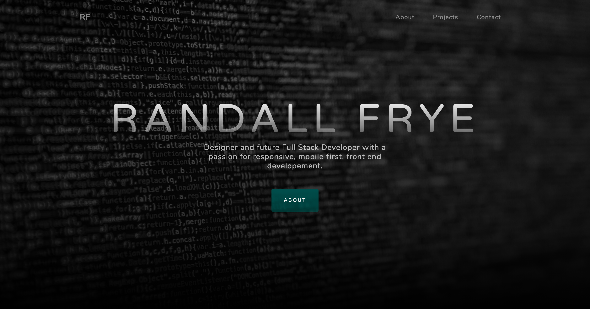
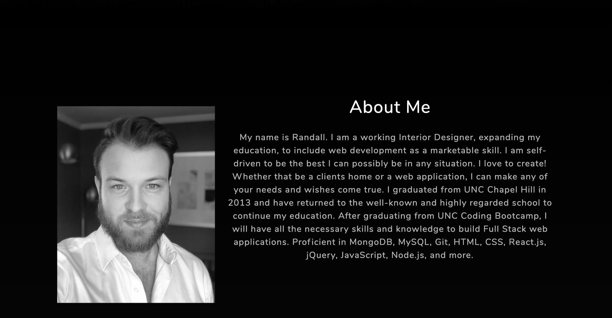
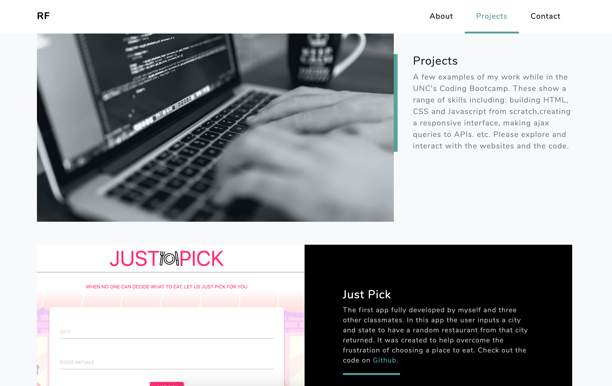
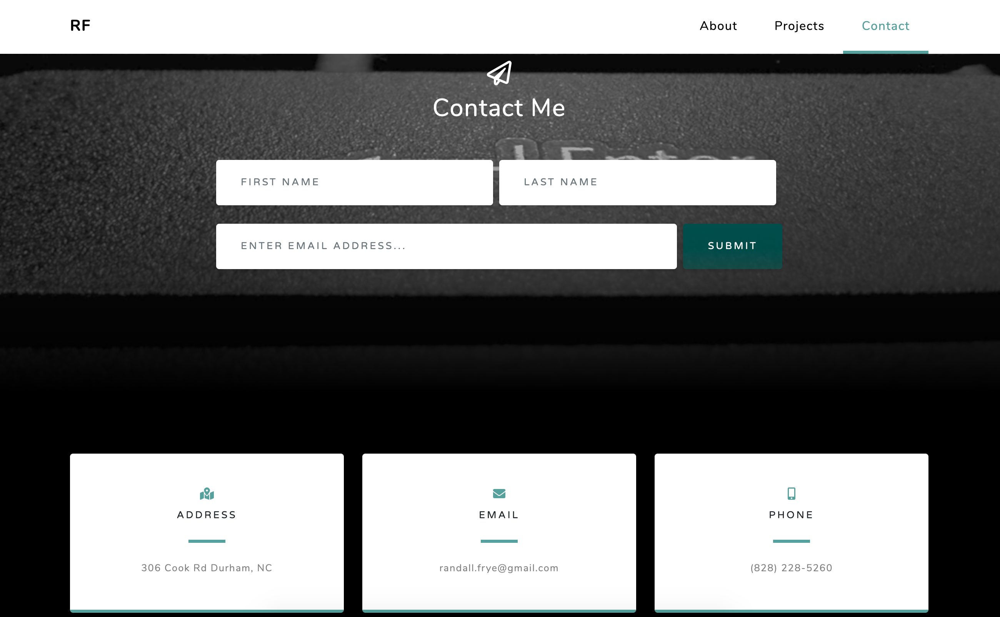

# Homework7
### Updated Portfolio 

#### Description

This project is intended to update our portfolio and show off more of our abilities as web developers.  Using a Bootstrap theme, I was able to customize the theme to fit the needs of the assignment and the desired appearance for my portfolio.  I have included screenshots and links to both the repositories and working deployed apps. The app consists of the landing image witha navigation bar and three main pieces.  The first is the "About Me" section with a brief description.  The second section is for the three chosen projects to show off.  Each project has a screen shot of the project and a short description of the use of each app.  The third section is for contacting me.  A short form allows the visitor to leave their name and email.  This section also displays my information and links to my social media and Github repository.  

#### Links 

* Git hub: https://github.com/rffrye/Homework7
* Deployed Page: https://rffrye.github.io/Homework7/

#### Screenshots 

 
 
 
 

#### Technologies Used 

* HTML
* CSS
* Javascript
* Bootstrap
* Bootstrap Themes

